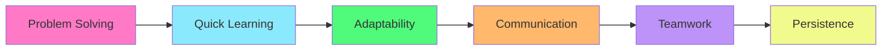

<div align="center">
  
  
  <h1>🌟 15-year-old AI Enthusiast & Future Software Engineer 🌟</h1>
  <h3>💫 Building intelligent systems and mastering the art of prompt engineering 💫</h3>
  
  <br>

  
  
  <br><br>
  
  [](https://github.com/ismailmuhammad15g-code)
  [](https://github.com/ismailmuhammad15g-code?tab=followers)
  [](https://github.com/ismailmuhammad15g-code)
  
  <br>
  
  [](#)
  [](#)
  [](#)
</div>


<br>

## 👨‍💻 About Me

<div align="center">
  
</div>

<br>

I'm **Ismail**, a passionate 15-year-old tech enthusiast from **Bangladesh** 🇧🇩 with a deep fascination for artificial intelligence and software development. I believe that code is poetry in motion – elegant, powerful, and capable of solving real-world problems.

### 🎯 My Journey Highlights

<table>
  <tr>
    <td align="center">✨</td>
    <td><strong>Currently diving deep into:</strong><br>AI fundamentals, Python programming, and the art of prompt engineering</td>
  </tr>
  <tr>
    <td align="center">🚀</td>
    <td><strong>Long-term vision:</strong><br>To become a software engineer specializing in artificial intelligence systems</td>
  </tr>
  <tr>
    <td align="center">💡</td>
    <td><strong>Personal philosophy:</strong><br>"The best code is not just functional, but also elegant, efficient, and designed with humans in mind"</td>
  </tr>
  <tr>
    <td align="center">🌱</td>
    <td><strong>Learning approach:</strong><br>Hands-on experimentation, building projects, and continuous improvement</td>
  </tr>
</table>

I spend my days learning, experimenting with new technologies, and building small projects that push my understanding of what's possible with code.


## 🛠️ Tech Stack & Tools

<div align="center">
  
### 💻 Programming Languages
  


### 🤖 AI & Machine Learning
  


### 🔧 Development Tools
  


### 📚 Learning & Focus Areas
  


</div>


## 🌱 Currently Learning

<div align="center">
  
</div>

<br>

### 📖 This Week's Focus

<table>
  <tr>
    <td width="50%">
      <h4>🎯 Advanced Prompt Engineering</h4>
      <ul>
        <li>Crafting effective prompts for AI interactions</li>
        <li>Understanding context and token optimization</li>
        <li>Multi-step reasoning techniques</li>
      </ul>
    </td>
    <td width="50%">
      <h4>🐍 Python Mastery</h4>
      <ul>
        <li>Data structures and algorithms</li>
        <li>Object-oriented programming</li>
        <li>Writing clean, pythonic code</li>
      </ul>
    </td>
  </tr>
  <tr>
    <td width="50%">
      <h4>🧠 Neural Networks</h4>
      <ul>
        <li>Building networks from scratch</li>
        <li>Understanding backpropagation</li>
        <li>Training and optimization techniques</li>
      </ul>
    </td>
    <td width="50%">
      <h4>⚙️ Developer Workflows</h4>
      <ul>
        <li>GitHub actions and CI/CD</li>
        <li>Version control best practices</li>
        <li>Collaborative development</li>
      </ul>
    </td>
  </tr>
</table>


## 💻 Featured Projects

<div align="center">
  
</div>

<br>

<details open>
<summary><h3>🤖 AI Prompt Library</h3></summary>

> **A curated collection of effective prompts for various AI tasks and use cases**
> 
> <table>
>   <tr>
>     <td><strong>🔧 Technologies:</strong></td>
>     <td>Python, Markdown, AI APIs</td>
>   </tr>
>   <tr>
>     <td><strong>📊 Status:</strong></td>
>     <td>🟡 In Development</td>
>   </tr>
>   <tr>
>     <td><strong>🎯 Goal:</strong></td>
>     <td>To create a community-driven repository of optimized prompts</td>
>   </tr>
>   <tr>
>     <td><strong>✨ Features:</strong></td>
>     <td>Categorized prompts, examples, best practices guide</td>
>   </tr>
> </table>

</details>

<details>
<summary><h3>🧠 Learning Assistant</h3></summary>

> **An AI-powered tool to help students understand complex programming concepts**
> 
> <table>
>   <tr>
>     <td><strong>🔧 Technologies:</strong></td>
>     <td>Python, OpenAI API, Streamlit</td>
>   </tr>
>   <tr>
>     <td><strong>📊 Status:</strong></td>
>     <td>🔵 Planning Phase</td>
>   </tr>
>   <tr>
>     <td><strong>🎯 Goal:</strong></td>
>     <td>Make learning to code more accessible and interactive</td>
>   </tr>
>   <tr>
>     <td><strong>✨ Features:</strong></td>
>     <td>Interactive explanations, code examples, personalized learning paths</td>
>   </tr>
> </table>

</details>

<details>
<summary><h3>📊 GitHub Analytics Dashboard</h3></summary>

> **Visualizing my coding journey and progress over time**
> 
> <table>
>   <tr>
>     <td><strong>🔧 Technologies:</strong></td>
>     <td>GitHub API, Python, Data Visualization Libraries</td>
>   </tr>
>   <tr>
>     <td><strong>📊 Status:</strong></td>
>     <td>🟢 Early Prototype</td>
>   </tr>
>   <tr>
>     <td><strong>🎯 Goal:</strong></td>
>     <td>Track learning progress and identify improvement areas</td>
>   </tr>
>   <tr>
>     <td><strong>✨ Features:</strong></td>
>     <td>Contribution graphs, language statistics, project timeline</td>
>   </tr>
> </table>

</details>


## 📈 GitHub Statistics & Activity

<div align="center">
  
</div>

<br>

### 📊 Contribution Stats

<div align="center">
  
  
  
  

</div>

### 💻 Language Distribution

<div align="center">
  
  
  
  

</div>

### 🏆 GitHub Trophies

<div align="center">
  
  

</div>

### 📊 Contribution Graph

<div align="center">
  
  [](https://github.com/ismailmuhammad15g-code)

</div>


## 🚀 Future Goals & Roadmap

<div align="center">
  
</div>

<br>

### 🎯 My Development Roadmap

<table>
  <tr>
    <th width="20%">Timeline</th>
    <th width="80%">Goals & Milestones</th>
  </tr>
  <tr>
    <td align="center">
      <h4>📅 Short-term</h4>
      <sub>(6 months)</sub>
    </td>
    <td>
      <ul>
        <li>✅ Build 3 complete AI-related projects</li>
        <li>🔄 Make first open source contributions</li>
        <li>📚 Complete Python intermediate course</li>
        <li>🤖 Master prompt engineering fundamentals</li>
        <li>💬 Join and engage with tech communities</li>
      </ul>
    </td>
  </tr>
  <tr>
    <td align="center">
      <h4>📆 Medium-term</h4>
      <sub>(1 year)</sub>
    </td>
    <td>
      <ul>
        <li>🎓 Master Python fundamentals completely</li>
        <li>🧠 Develop deep understanding of AI/ML concepts</li>
        <li>📱 Build a full-stack AI application</li>
        <li>👥 Contribute regularly to open source projects</li>
        <li>📝 Start writing technical blog posts</li>
        <li>🏆 Participate in coding competitions</li>
      </ul>
    </td>
  </tr>
  <tr>
    <td align="center">
      <h4>📅 Long-term</h4>
      <sub>(5 years)</sub>
    </td>
    <td>
      <ul>
        <li>💼 Become a proficient software engineer</li>
        <li>🎯 Specialize in AI systems that solve meaningful problems</li>
        <li>🌍 Build products that impact thousands of users</li>
        <li>👨‍🏫 Mentor aspiring developers</li>
        <li>🚀 Launch my own tech startup or join innovative company</li>
        <li>📚 Contribute to AI research and development</li>
      </ul>
    </td>
  </tr>
</table>


## 🎨 Skills & Expertise

<div align="center">

### 💪 Core Competencies

<table>
  <tr>
    <td align="center" width="33%">
      <h3>🐍 Python Development</h3>
      
      <p>Writing clean, efficient Python code<br>Data structures & algorithms<br>Problem-solving skills</p>
    </td>
    <td align="center" width="33%">
      <h3>🤖 AI & Prompt Engineering</h3>
      
      <p>Crafting effective AI prompts<br>Understanding LLM capabilities<br>Building AI-powered tools</p>
    </td>
    <td align="center" width="33%">
      <h3>🌐 Web Technologies</h3>
      
      <p>HTML, CSS, JavaScript basics<br>Building simple web interfaces<br>Understanding web architecture</p>
    </td>
  </tr>
</table>

### 🎯 Soft Skills



</div>


## 💬 Inspirational Quote

<div align="center">
  
</div>


## 🤝 Connect With Me

<div align="center">
  
</div>

<br>

<div align="center">
  
  ### 📬 Reach Me At
  
  [](mailto:solomismailYt12@gmail.com)
  [](https://discord.com/users/ismailmohammadzetsu)
  [](https://hackclub.com/slack/)
  [](https://github.com/ismailmuhammad15g-code)

</div>

<br>

<div align="center">
  
  <table>
    <tr>
      <td align="center" width="33%">
        <br>
        <strong>Email</strong><br>
        <a href="mailto:solomismailYt12@gmail.com">solomismailYt12@gmail.com</a>
      </td>
      <td align="center" width="33%">
        <br>
        <strong>Discord</strong><br>
        @ismailmohammadzetsu
      </td>
      <td align="center" width="33%">
        <br>
        <strong>Slack & Hack Club</strong><br>
        @ismailmuhammad15g-code
      </td>
    </tr>
  </table>

  ### 🌟 Open for
  
  [](mailto:solomismailYt12@gmail.com)
  [](mailto:solomismailYt12@gmail.com)
  [](mailto:solomismailYt12@gmail.com)
  [](mailto:solomismailYt12@gmail.com)

</div>


## 🎓 Learning Resources & Recommendations

<div align="center">

### 📚 My Favorite Learning Platforms

<table>
  <tr>
    <td align="center" width="25%">
      <br>
      <strong>YouTube</strong><br>
      <sub>Free tutorials & courses</sub>
    </td>
    <td align="center" width="25%">
      <br>
      <strong>Documentation</strong><br>
      <sub>Official docs & guides</sub>
    </td>
    <td align="center" width="25%">
      <br>
      <strong>Stack Overflow</strong><br>
      <sub>Problem solving</sub>
    </td>
    <td align="center" width="25%">
      <br>
      <strong>GitHub</strong><br>
      <sub>Open source learning</sub>
    </td>
  </tr>
</table>

</div>


## 🏆 Achievements & Milestones

<div align="center">

### 🌟 My Journey So Far

| 🎯 Milestone | 📅 Date | 💡 Details |
|-------------|---------|-----------|
| 🎂 Started Coding Journey | 2023 | Began learning Python and web development |
| 🤖 Discovered AI | 2024 | Found my passion for artificial intelligence |
| 📚 Prompt Engineering | 2024 | Started mastering the art of prompt engineering |
| 💻 GitHub Profile | 2024 | Created professional GitHub presence |
| 🚀 First Projects | 2024 | Building real-world AI applications |

</div>


## 📊 Weekly Development Breakdown

<div align="center">

```text
💻 Programming     ████████████████░░░░░   75%
🤖 AI Learning     ████████████░░░░░░░░░   60%
📚 Reading Docs    ██████████░░░░░░░░░░░   50%
🏗️  Building        ████████░░░░░░░░░░░░░   40%
👥 Networking      ████░░░░░░░░░░░░░░░░░   20%
```

</div>


---

<div align="center">
  
  
  
  <br>
  
  <h2>✨ Thank You for Visiting! ✨</h2>
  
  <p><i>I'm continuously learning and growing in my software engineering journey. Let's build something amazing together! 🚀</i></p>
  
  <br>

  
  
  <br>
  
  
  
  <br>
  
  
  
  <br><br>
  
  ### 💖 Support My Journey
  
  <p>If you find my work interesting or helpful, consider:</p>
  
  ⭐ **Starring** my repositories<br>
  👀 **Following** me on GitHub<br>
  💬 **Connecting** with me on social platforms<br>
  🤝 **Collaborating** on exciting projects<br>
  
  <br>
  
  <!-- Snake animation - Requires GitHub Actions workflow to generate
  
  -->
  
  <br>
  
  <sub>Made with ❤️ and lots of ☕ by Ismail Mohammad</sub><br>
  <sub>© 2024 Ismail Mohammad. All rights reserved.</sub>
  
  <br><br>
  
  
  
</div>
